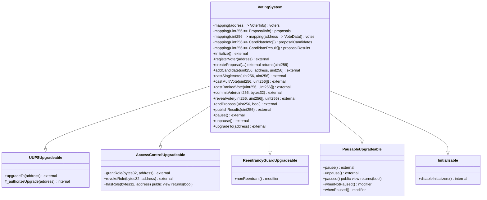

# ADR-001: 合约架构设计

## 状态
Accepted

## 背景

PRD 定义了一个去中心化智能合约投票系统，需要支持选民管理、提案管理、投票执行、计票结果发布等多个功能模块。在开始实现前，需要确定合约的整体架构模式。

## 决策

**采用单合约架构（Monolithic Design）**

### 决策理由

1. **功能耦合度分析**
   - 选民管理、提案管理、投票执行三个模块之间紧密关联
   - 投票操作需要同时更新选民状态和提案数据
   - 分离会导致跨合约调用增加Gas消耗

2. **Gas优化考虑**
   - 非功能要求投票交易Gas ≤ 150,000 gas
   - 跨合约调用需要额外7,000-10,000 gas/次
   - 单合约可避免Delegatecall开销

3. **管理复杂度**
   - PRD规模相对中等，单合约易于维护
   - 升级时只需升级一个合约，降低升级风险
   - 避免合约间地址依赖的管理复杂度

4. **可验证性**
   - 所有数据集中在单一存储，便于Etherscan验证
   - 事件日志完整，The Graph索引更简单

## 合约架构图（Mermaid）



## 关键设计点

### 存储布局（Storage Layout）

```solidity
contract VotingSystemUpgradeable is
    Initializable,
    AccessControlUpgradeable,
    ReentrancyGuardUpgradeable,
    PausableUpgradeable,
    UUPSUpgradeable
{
    // === Role Definitions ===
    bytes32 public constant ADMIN_ROLE = keccak256("ADMIN_ROLE");
    bytes32 public constant EMERGENCY_ROLE = keccak256("EMERGENCY_ROLE");
    bytes32 public constant AUDITOR_ROLE = keccak256("AUDITOR_ROLE");

    // === Slot 0-9: System Config ===
    bool private _initialized;
    bool private _initializing;
    uint256 private __gap_0;

    // === Slot 10-19: Voter Mappings ===
    mapping(address => VoterInfo) public voters;
    address[] public voterList;
    uint256 public voterCount;

    // === Slot 20-29: Proposal Mappings ===
    mapping(uint256 => ProposalInfo) public proposals;
    mapping(uint256 => CandidateInfo[]) public proposalCandidates;
    uint256 public proposalCount;
    uint256[] public activeProposals;

    // === Slot 30-39: Voting Data ===
    mapping(uint256 => mapping(address => VoteData)) public votes;
    mapping(uint256 => CandidateResult[]) public proposalResults;

    // === Slot 40-49: Commit-Reveal ===
    mapping(uint256 => mapping(address => bytes32)) public commitHashes;
    mapping(uint256 => mapping(address => uint256)) public commitTimestamps;

    // === Slot 50-59: System Configuration ===
    address public voterOracle;
    uint256 public votingDelay;
    uint256 public votingDuration;
    uint256 public minVoters;

    // === Slot 60+: Reserved for Future Upgrades ===
    uint256[50] private __gap;
}
```

### 数据结构定义

```solidity
struct VoterInfo {
    bool isRegistered;
    bool isEligible;
    uint256 registrationTime;
    uint256 votesCast;
    mapping(uint256 => bool) hasVoted;
    uint256 reputationScore;
}

struct CandidateInfo {
    address candidateAddress;
    uint256 voteWeight;
    uint256 voteCount;
    string metadata;
}

struct ProposalInfo {
    uint256 id;
    address creator;
    string title;
    string description;
    uint64 startTime;
    uint64 endTime;
    uint16 candidateCount;
    bool isRanked;
    bool isMultiChoice;
    bool isActive;
    VotingType votingType;
    ProposalStatus status;
    bool resultsPublished;
    uint256 totalVotes;
    uint256 quorum;
}

enum VotingType {
    SingleChoice,
    MultiChoice,
    RankedChoice,
    WeightedChoice
}

enum ProposalStatus {
    Pending,
    Active,
    Ended,
    Cancelled
}

struct VoteData {
    uint256[] candidateIndices;
    uint256[] rankings;
    uint256 timestamp;
    bool isRevealed;
}

struct CandidateResult {
    uint256 candidateIndex;
    uint256 voteCount;
    uint256 weightedVotes;
    uint256 ranking;
}
```

### 权限模型（AccessControl）

```solidity
// 核心角色
bytes32 public constant ADMIN_ROLE = keccak256("ADMIN_ROLE");
bytes32 public constant EMERGENCY_ROLE = keccak256("EMERGENCY_ROLE");
bytes32 public constant AUDITOR_ROLE = keccak256("AUDITOR_ROLE");

// 职责划分
// ADMIN_ROLE: 创建提案、修改配置、执行升级
// EMERGENCY_ROLE: 暂停/恢复合约
// AUDITOR_ROLE: 验证结果、审计日志（只读）
```

### 升级策略（UUPS）

- 采用 UUPS (Universal Upgradeable Proxy Standard) 模式
- 逻辑合约控制升级权限和执行
- 预留存储槽位 `__gap` 用于未来扩展
- 升级前验证存储布局兼容性

### 事件设计

```solidity
event VoterRegistered(address indexed voter, uint256 indexed timestamp, uint256 totalVoters);
event VoterRemoved(address indexed voter, uint256 indexed timestamp, uint256 remainingVoters);
event ProposalCreated(uint256 indexed proposalId, address indexed creator, string title, uint256 startTime, uint256 endTime, VotingType votingType);
event CandidateAdded(uint256 indexed proposalId, address indexed candidate, uint256 weight, uint256 candidateIndex);
event VoteCast(uint256 indexed proposalId, address indexed voter, uint256[] candidateIndices, uint256 timestamp);
event VoteCommitted(uint256 indexed proposalId, address indexed voter, bytes32 commitmentHash, uint256 timestamp);
event VoteRevealed(uint256 indexed proposalId, address indexed voter, uint256[] candidateIndices, uint256 timestamp);
event ProposalEnded(uint256 indexed proposalId, uint256 totalVotes, uint256 quorum, bool quorumReached);
event ResultsPublished(uint256 indexed proposalId, uint256 winningCandidate, uint256 winningVotes, CandidateResult[] results);
event ContractPaused(address indexed admin, uint256 timestamp);
event ContractUnpaused(address indexed admin, uint256 timestamp);
event UpgradeScheduled(address indexed currentImpl, address indexed newImpl, uint256 timestamp);
```

### 错误处理（Custom Errors）

```solidity
error VoterAlreadyRegistered(address voter);
error VoterNotRegistered(address voter);
error ProposalDoesNotExist(uint256 proposalId);
error ProposalNotActive(uint256 proposalId);
error VotingNotStarted(uint256 proposalId);
error VotingEnded(uint256 proposalId);
error AlreadyVoted(address voter, uint256 proposalId);
error InvalidCandidateIndex(uint256 proposalId, uint256 index);
error InsufficientVotes(uint256 proposalId, uint256 required, uint256 actual);
error ContractPaused();
error ContractNotPaused();
error Unauthorized(address caller, bytes32 requiredRole);
error InvalidCommitment();
```

## 替代方案

### 方案 A: 多合约架构（Modular Design）

**描述**: 将系统拆分为多个独立合约：
- `VoterRegistry`: 选民管理
- `ProposalManager`: 提案管理
- `VotingExecutor`: 投票执行
- `ResultsPublisher`: 结果发布

**优点**:
- 职责分离清晰
- 单个合约可独立升级
- 便于功能扩展

**缺点**:
- 跨合约调用增加 Gas 消耗
- 管理复杂度高（多合约地址依赖）
- 数据分散，可验证性降低

**不选择理由**: PRD 要求单次投票 Gas ≤ 150,000，多合约架构难以满足此要求。

### 方案 B: Diamond Pattern（EIP-2535）

**描述**: 使用钻石代理模式，将功能模块化为 Facet。

**优点**:
- 完全可扩展，合约大小无限制
- 支持无限功能模块
- 各 Facet 可独立升级

**缺点**:
- 实现复杂度高
- Gas 消耗略高于 UUPS
- 社区实践较少，风险较高

**不选择理由**: 项目规模中等，UUPS 已足够满足需求，Diamond Pattern 过度设计。

## 影响与风险

### 正面影响
- 代码结构清晰，易于理解和维护
- Gas 消耗优化，满足 PRD 性能要求
- 升级流程简单，降低升级风险

### 潜在风险
- 合约代码规模较大，可能超过 24KB 限制
- 修改任何功能都需要升级整个合约
- 单点故障风险（如核心逻辑有漏洞）

### 风险缓解
- 预留存储槽位，支持未来扩展
- 采用 UUPS 模式，降低升级成本
- 充分测试和安全审计
- 实现紧急暂停机制

## Status: READY_FOR_BUILD
