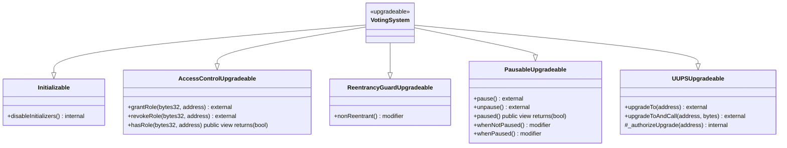

# VotingSystem 合约规格

## 合约继承关系



## 状态变量

### 角色定义

| 变量名 | 类型 | 可见性 | 说明 |
|--------|------|--------|------|
| `ADMIN_ROLE` | bytes32 | constant | 管理员角色 |
| `EMERGENCY_ROLE` | bytes32 | constant | 紧急管理员角色 |
| `AUDITOR_ROLE` | bytes32 | constant | 审计员角色 |

### 系统配置

| 变量名 | 类型 | 可见性 | 说明 |
|--------|------|--------|------|
| `voterOracle` | address | public | 选民资格验证 Oracle 地址 |
| `votingDelay` | uint256 | public | 投票延迟时间（秒） |
| `votingDuration` | uint256 | public | 投票持续时间（秒） |
| `minVoters` | uint256 | public | 最少选民数 |

### 选民数据

| 变量名 | 类型 | 可见性 | 说明 |
|--------|------|--------|------|
| `voters` | mapping(address => VoterInfo) | public | 选民信息映射 |
| `voterList` | address[] | public | 选民地址列表 |
| `voterCount` | uint256 | public | 选民总数 |

### 提案数据

| 变量名 | 类型 | 可见性 | 说明 |
|--------|------|--------|------|
| `proposals` | mapping(uint256 => ProposalInfo) | public | 提案信息映射 |
| `proposalCandidates` | mapping(uint256 => CandidateInfo[]) | public | 提案候选人映射 |
| `proposalCount` | uint256 | public | 提案总数 |
| `activeProposals` | uint256[] | public | 活跃提案 ID 列表 |

### 投票数据

| 变量名 | 类型 | 可见性 | 说明 |
|--------|------|--------|------|
| `votes` | mapping(uint256 => mapping(address => VoteData)) | public | 投票数据映射 |
| `proposalResults` | mapping(uint256 => CandidateResult[]) | public | 提案结果映射 |

### Commit-Reveal 数据

| 变量名 | 类型 | 可见性 | 说明 |
|--------|------|--------|------|
| `commitHashes` | mapping(uint256 => mapping(address => bytes32)) | public | 提交哈希映射 |
| `commitTimestamps` | mapping(uint256 => mapping(address => uint256)) | public | 提交时间戳映射 |

### 升级预留

| 变量名 | 类型 | 可见性 | 说明 |
|--------|------|--------|------|
| `__gap` | uint256[50] | private | 预留存储槽位 |

## 事件列表

| 事件名 | 参数 | 说明 |
|--------|------|------|
| `VoterRegistered` | `address indexed voter`, `uint256 indexed timestamp`, `uint256 totalVoters` | 选民注册 |
| `VoterRemoved` | `address indexed voter`, `uint256 indexed timestamp`, `uint256 remainingVoters` | 选民移除 |
| `ProposalCreated` | `uint256 indexed proposalId`, `address indexed creator`, `string title`, `uint256 startTime`, `uint256 endTime`, `VotingType votingType` | 提案创建 |
| `CandidateAdded` | `uint256 indexed proposalId`, `address indexed candidate`, `uint256 weight`, `uint256 candidateIndex` | 候选人添加 |
| `VoteCast` | `uint256 indexed proposalId`, `address indexed voter`, `uint256[] candidateIndices`, `uint256 timestamp` | 投票提交 |
| `VoteCommitted` | `uint256 indexed proposalId`, `address indexed voter`, `bytes32 commitmentHash`, `uint256 timestamp` | Commit-Reveal 提交 |
| `VoteRevealed` | `uint256 indexed proposalId`, `address indexed voter`, `uint256[] candidateIndices`, `uint256 timestamp` | Commit-Reveal 揭示 |
| `ProposalEnded` | `uint256 indexed proposalId`, `uint256 totalVotes`, `uint256 quorum`, `bool quorumReached` | 提案结束 |
| `ResultsPublished` | `uint256 indexed proposalId`, `uint256 winningCandidate`, `uint256 winningVotes`, `CandidateResult[] results` | 结果发布 |
| `ContractPaused` | `address indexed admin`, `uint256 timestamp` | 合约暂停 |
| `ContractUnpaused` | `address indexed admin`, `uint256 timestamp` | 合约恢复 |
| `UpgradeScheduled` | `address indexed currentImpl`, `address indexed newImpl`, `uint256 timestamp` | 合约升级 |

## 函数签名与行为描述

### 初始化函数

#### `initialize(address _admin, address _emergencyAdmin, address _auditor)`

| 属性 | 值 |
|------|-----|
| 可见性 | external |
| 修饰器 | initializer |

**行为**: 初始化合约，设置角色权限

**参数**:
- `_admin`: 管理员地址
- `_emergencyAdmin`: 紧急管理员地址
- `_auditor`: 审计员地址

**返回值**: 无

### 选民管理函数

#### `registerVoter(address voter)`

| 属性 | 值 |
|------|-----|
| 可见性 | external |
| 修饰符 | onlyAdmin, whenNotPaused |

**行为**: 注册单个选民

**参数**:
- `voter`: 选民地址

**返回值**: 无

**事件**: `VoterRegistered`

#### `batchRegisterVoters(address[] calldata voterAddresses)`

| 属性 | 值 |
|------|-----|
| 可见性 | external |
| 修饰符 | onlyAdmin, whenNotPaused |

**行为**: 批量注册选民

**参数**:
- `voterAddresses`: 选民地址数组

**返回值**: 无

**事件**: `VoterRegistered` (每个选民触发一次)

#### `removeVoter(address voter)`

| 属性 | 值 |
|------|-----|
| 可见性 | external |
| 修饰符 | onlyAdmin, whenNotPaused |

**行为**: 移除选民

**参数**:
- `voter`: 选民地址

**返回值**: 无

**事件**: `VoterRemoved`

### 提案管理函数

#### `createProposal(string memory title, string memory description, uint64 startTime, uint256 duration, VotingType votingType, uint256 quorum)`

| 属性 | 值 |
|------|-----|
| 可见性 | external |
| 修饰符 | onlyAdmin, whenNotPaused |

**行为**: 创建新提案

**参数**:
- `title`: 提案标题
- `description`: 描述
- `startTime`: 开始时间戳
- `duration`: 持续时间（秒）
- `votingType`: 投票类型
- `quorum`: 法定人数

**返回值**: `proposalId` (uint256)

**事件**: `ProposalCreated`

#### `addCandidate(uint256 proposalId, address candidate, uint256 weight)`

| 属性 | 值 |
|------|-----|
| 可见性 | external |
| 修饰符 | onlyAdmin, proposalExists, whenNotPaused |

**行为**: 添加单个候选人

**参数**:
- `proposalId`: 提案 ID
- `candidate`: 候选人地址
- `weight`: 权重

**返回值**: 无

**事件**: `CandidateAdded`

#### `batchAddCandidates(uint256 proposalId, address[] calldata candidates, uint256[] calldata weights)`

| 属性 | 值 |
|------|-----|
| 可见性 | external |
| 修饰符 | onlyAdmin, proposalExists, whenNotPaused |

**行为**: 批量添加候选人

**参数**:
- `proposalId`: 提案 ID
- `candidates`: 候选人地址数组
- `weights`: 权重数组

**返回值**: 无

**事件**: `CandidateAdded` (每个候选人触发一次)

### 投票执行函数

#### `castSingleVote(uint256 proposalId, uint256 candidateIndex)`

| 属性 | 值 |
|------|-----|
| 可见性 | external |
| 修饰符 | nonReentrant, onlyRegisteredVoter, proposalExists, proposalActive, hasNotVoted, whenNotPaused |

**行为**: 单选投票

**参数**:
- `proposalId`: 提案 ID
- `candidateIndex`: 候选人索引

**返回值**: 无

**事件**: `VoteCast`

**Gas 预估**: ~85,000

#### `castMultiVote(uint256 proposalId, uint256[] calldata candidateIndices)`

| 属性 | 值 |
|------|-----|
| 可见性 | external |
| 修饰符 | nonReentrant, onlyRegisteredVoter, proposalExists, proposalActive, hasNotVoted, whenNotPaused |

**行为**: 多选投票

**参数**:
- `proposalId`: 提案 ID
- `candidateIndices`: 候选人索引数组

**返回值**: 无

**事件**: `VoteCast`

**Gas 预估**: ~120,000 + 5,000 * N

#### `castRankedVote(uint256 proposalId, uint256[] calldata rankings)`

| 属性 | 值 |
|------|-----|
| 可见性 | external |
| 修饰符 | nonReentrant, onlyRegisteredVoter, proposalExists, proposalActive, hasNotVoted, whenNotPaused |

**行为**: 排序投票

**参数**:
- `proposalId`: 提案 ID
- `rankings`: 排序数组（index 为排名，value 为候选人索引）

**返回值**: 无

**事件**: `VoteCast`

**Gas 预估**: ~130,000 + 5,000 * N

### Commit-Reveal 函数

#### `commitVote(uint256 proposalId, bytes32 commitmentHash)`

| 属性 | 值 |
|------|-----|
| 可见性 | external |
| 修饰符 | nonReentrant, onlyRegisteredVoter, proposalExists, proposalActive, whenNotPaused |

**行为**: 提交投票哈希（Commit 阶段）

**参数**:
- `proposalId`: 提案 ID
- `commitmentHash`: 哈希值

**返回值**: 无

**事件**: `VoteCommitted`

**Gas 预估**: ~70,000

#### `revealVote(uint256 proposalId, uint256[] calldata candidateIndices, uint256 nonce)`

| 属性 | 值 |
|------|-----|
| 可见性 | external |
| 修饰符 | nonReentrant, onlyRegisteredVoter, proposalExists, whenNotPaused |

**行为**: 揭示投票（Reveal 阶段）

**参数**:
- `proposalId`: 提案 ID
- `candidateIndices`: 候选人索引数组
- `nonce`: 随机数

**返回值**: 无

**事件**: `VoteRevealed`

**Gas 预估**: ~90,000

### 计票与结果发布函数

#### `endProposal(uint256 proposalId, bool publishResults)`

| 属性 | 值 |
|------|-----|
| 可见性 | external |
| 修饰符 | onlyAdmin, proposalExists, whenNotPaused |

**行为**: 结束提案并计算结果

**参数**:
- `proposalId`: 提案 ID
- `publishResults`: 是否立即发布结果

**返回值**: 无

**事件**: `ProposalEnded`, `ResultsPublished` (如果 publishResults 为 true)

**Gas 预估**: ~200,000

#### `publishResults(uint256 proposalId)`

| 属性 | 值 |
|------|-----|
| 可见性 | external |
| 修饰符 | onlyAdmin, proposalExists, whenNotPaused |

**行为**: 发布投票结果

**参数**:
- `proposalId`: 提案 ID

**返回值**: 无

**事件**: `ResultsPublished`

**Gas 预估**: ~250,000

### 查询函数

#### `getProposalResults(uint256 proposalId)`

| 属性 | 值 |
|------|-----|
| 可见性 | external |
| 修饰符 | proposalExists |

**行为**: 获取投票结果

**参数**:
- `proposalId`: 提案 ID

**返回值**: `CandidateResult[] memory results`

#### `getProposal(uint256 proposalId)`

| 属性 | 值 |
|------|-----|
| 可见性 | external |
| 修饰符 | proposalExists |

**行为**: 获取提案详情

**参数**:
- `proposalId`: 提案 ID

**返回值**: `ProposalInfo memory proposal`

#### `getProposalCandidates(uint256 proposalId)`

| 属性 | 值 |
|------|-----|
| 可见性 | external |
| 修饰符 | proposalExists |

**行为**: 获取提案候选人

**参数**:
- `proposalId`: 提案 ID

**返回值**: `CandidateInfo[] memory candidates`

#### `getVoterVotingHistory(address voter)`

| 属性 | 值 |
|------|-----|
| 可见性 | external |

**行为**: 获取选民投票历史

**参数**:
- `voter`: 选民地址

**返回值**: `uint256[] memory votedProposalIds`

#### `getActiveProposals()`

| 属性 | 值 |
|------|-----|
| 可见性 | external |

**行为**: 获取活跃提案列表

**参数**: 无

**返回值**: `uint256[] memory activeProposalIds`

#### `getAllProposals()`

| 属性 | 值 |
|------|-----|
| 可见性 | external |

**行为**: 获取所有提案 ID

**参数**: 无

**返回值**: `uint256[] memory allProposalIds`

### 权限管理函数

#### `pause()`

| 属性 | 值 |
|------|-----|
| 可见性 | external |
| 修饰符 | onlyEmergencyAdmin, whenNotPaused |

**行为**: 暂停合约

**参数**: 无

**返回值**: 无

**事件**: `ContractPaused`

**Gas 预估**: ~35,000

#### `unpause()`

| 属性 | 值 |
|------|-----|
| 可见性 | external |
| 修饰符 | onlyEmergencyAdmin, whenPaused |

**行为**: 恢复合约

**参数**: 无

**返回值**: 无

**事件**: `ContractUnpaused`

**Gas 预估**: ~35,000

### 配置管理函数

#### `setOracle(address _oracle)`

| 属性 | 值 |
|------|-----|
| 可见性 | external |
| 修饰符 | onlyAdmin, whenNotPaused |

**行为**: 设置 Oracle

**参数**:
- `_oracle`: Oracle 地址

**返回值**: 无

#### `setVotingDelay(uint256 delay)`

| 属性 | 值 |
|------|-----|
| 可见性 | external |
| 修饰符 | onlyAdmin, whenNotPaused |

**行为**: 设置投票延迟时间

**参数**:
- `delay`: 延迟时间（秒）

**返回值**: 无

#### `setVotingDuration(uint256 duration)`

| 属性 | 值 |
|------|-----|
| 可见性 | external |
| 修饰符 | onlyAdmin, whenNotPaused |

**行为**: 设置投票持续时间

**参数**:
- `duration`: 持续时间（秒）

**返回值**: 无

#### `setQuorum(uint256 proposalId, uint256 quorum)`

| 属性 | 值 |
|------|-----|
| 可见性 | external |
| 修饰符 | onlyAdmin, proposalExists, whenNotPaused |

**行为**: 设置法定人数

**参数**:
- `proposalId`: 提案 ID
- `quorum`: 法定人数

**返回值**: 无

### 审计函数

#### `verifyResults(uint256 proposalId)`

| 属性 | 值 |
|------|-----|
| 可见性 | external |
| 修饰符 | onlyAuditor, proposalExists |

**行为**: 验证投票结果

**参数**:
- `proposalId`: 提案 ID

**返回值**: `bool valid`

### 升级函数

#### `_authorizeUpgrade(address newImplementation)`

| 属性 | 值 |
|------|-----|
| 可见性 | internal |
| 修饰符 | onlyAdmin |

**行为**: 升级授权（UUPS）

**参数**:
- `newImplementation`: 新实现合约地址

**返回值**: 无

**事件**: `UpgradeScheduled`

## 权限矩阵

| 函数 | ADMIN | EMERGENCY | AUDITOR | PUBLIC |
|------|--------|-----------|---------|--------|
| initialize | ✗ | ✗ | ✗ | ✗ (only once) |
| registerVoter | ✓ | ✗ | ✗ | ✗ |
| batchRegisterVoters | ✓ | ✗ | ✗ | ✗ |
| removeVoter | ✓ | ✗ | ✗ | ✗ |
| createProposal | ✓ | ✗ | ✗ | ✗ |
| addCandidate | ✓ | ✗ | ✗ | ✗ |
| batchAddCandidates | ✓ | ✗ | ✗ | ✗ |
| castSingleVote | ✗ | ✗ | ✗ | ✓ (if registered) |
| castMultiVote | ✗ | ✗ | ✗ | ✓ (if registered) |
| castRankedVote | ✗ | ✗ | ✗ | ✓ (if registered) |
| commitVote | ✗ | ✗ | ✗ | ✓ (if registered) |
| revealVote | ✗ | ✗ | ✗ | ✓ (if registered) |
| endProposal | ✓ | ✗ | ✗ | ✗ |
| publishResults | ✓ | ✗ | ✗ | ✗ |
| pause | ✗ | ✓ | ✗ | ✗ |
| unpause | ✗ | ✓ | ✗ | ✗ |
| setOracle | ✓ | ✗ | ✗ | ✗ |
| setVotingDelay | ✓ | ✗ | ✗ | ✗ |
| setVotingDuration | ✓ | ✗ | ✗ | ✗ |
| setQuorum | ✓ | ✗ | ✗ | ✗ |
| verifyResults | ✗ | ✗ | ✓ | ✗ |
| getProposalResults | ✗ | ✗ | ✗ | ✓ |
| getProposal | ✗ | ✗ | ✗ | ✓ |
| getProposalCandidates | ✗ | ✗ | ✗ | ✓ |
| getVoterVotingHistory | ✗ | ✗ | ✗ | ✓ |
| getActiveProposals | ✗ | ✗ | ✗ | ✓ |
| getAllProposals | ✗ | ✗ | ✗ | ✓ |

## Gas 估算

| 函数名 | 基础 Gas | 存储操作 | 事件日志 | 总预估 | 备注 |
|--------|---------|---------|---------|--------|------|
| `initialize` | 50,000 | 3 SWRITE | 1 Event | 120,000 | 初始化角色 |
| `registerVoter` | 20,000 | 1 SWRITE | 1 Event | 45,000 | 新选民注册 |
| `batchRegisterVoters` | 30,000 | N*SWRITE | 1 Event | 45,000 + 40,000*N | 批量注册 |
| `removeVoter` | 25,000 | 1 SWRITE | 1 Event | 50,000 | 移除选民 |
| `createProposal` | 40,000 | 3 SWRITE | 1 Event | 150,000 | 创建提案 |
| `addCandidate` | 25,000 | 2 SWRITE | 1 Event | 80,000 | 添加候选人 |
| `castSingleVote` | 35,000 | 2 SWRITE | 1 Event | 85,000 | 单选投票 |
| `castMultiVote` | 50,000 | 3+N SWRITE | 1 Event | 120,000 + 5,000*N | 多选投票 |
| `castRankedVote` | 55,000 | 3+N SWRITE | 1 Event | 130,000 + 5,000*N | 排序投票 |
| `commitVote` | 30,000 | 2 SWRITE | 1 Event | 70,000 | Commit阶段 |
| `revealVote` | 40,000 | 2 SWRITE | 1 Event | 90,000 | Reveal阶段 |
| `endProposal` | 60,000 | 2 SWRITE | 1 Event | 200,000 | 含计票 |
| `publishResults` | 70,000 | 3 SWRITE | 1 Event | 250,000 | 含结果存储 |
| `pause` | 15,000 | 1 SWRITE | 1 Event | 35,000 | 暂停合约 |
| `unpause` | 15,000 | 1 SWRITE | 1 Event | 35,000 | 恢复合约 |

## 数据结构定义

### VoterInfo
```solidity
struct VoterInfo {
    bool isRegistered;
    bool isEligible;
    uint256 registrationTime;
    uint256 votesCast;
    mapping(uint256 => bool) hasVoted;
    uint256 reputationScore;
}
```

### CandidateInfo
```solidity
struct CandidateInfo {
    address candidateAddress;
    uint256 voteWeight;
    uint256 voteCount;
    string metadata;
}
```

### ProposalInfo
```solidity
struct ProposalInfo {
    uint256 id;
    address creator;
    string title;
    string description;
    uint64 startTime;
    uint64 endTime;
    uint16 candidateCount;
    bool isRanked;
    bool isMultiChoice;
    bool isActive;
    VotingType votingType;
    ProposalStatus status;
    bool resultsPublished;
    uint256 totalVotes;
    uint256 quorum;
}
```

### VotingType
```solidity
enum VotingType {
    SingleChoice,
    MultiChoice,
    RankedChoice,
    WeightedChoice
}
```

### ProposalStatus
```solidity
enum ProposalStatus {
    Pending,
    Active,
    Ended,
    Cancelled
}
```

### VoteData
```solidity
struct VoteData {
    uint256[] candidateIndices;
    uint256[] rankings;
    uint256 timestamp;
    bool isRevealed;
}
```

### CandidateResult
```solidity
struct CandidateResult {
    uint256 candidateIndex;
    uint256 voteCount;
    uint256 weightedVotes;
    uint256 ranking;
}
```

## 自定义错误

```solidity
error VoterAlreadyRegistered(address voter);
error VoterNotRegistered(address voter);
error ProposalDoesNotExist(uint256 proposalId);
error ProposalNotActive(uint256 proposalId);
error VotingNotStarted(uint256 proposalId);
error VotingEnded(uint256 proposalId);
error AlreadyVoted(address voter, uint256 proposalId);
error InvalidCandidateIndex(uint256 proposalId, uint256 index);
error InsufficientVotes(uint256 proposalId, uint256 required, uint256 actual);
error ContractPaused();
error ContractNotPaused();
error Unauthorized(address caller, bytes32 requiredRole);
error InvalidCommitment();
error ArrayLengthMismatch();
error InvalidTimeRange();
error ZeroAddress();
```

---

**Status: READY_FOR_BUILD**
